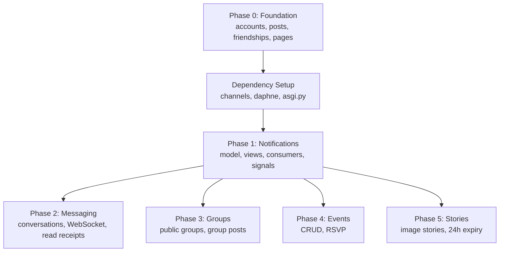

# CEO Plan: Full Feature Parity — Phased Rollout
Generated by /plan-ceo-review on 2026-07-11 | Reviewed by /plan-eng-review on 2026-07-11
Branch: main | Mode: SELECTIVE EXPANSION
Repo: Musthak2004/FaceBook-Clone

## Vision

### 10x Check
A hiring manager visits the live URL and sees a fully-featured social network that doesn't feel like a tutorial project — it feels like a real product. Messages arrive in real-time. Notifications pop instantly. Stories auto-advance. Groups have conversations. Events have RSVPs. The experience is cohesive, not bolted-together apps. The whole feels greater than the sum of its parts because notifications and messaging are the connective tissue between every other feature.

### What makes this different from the old version
The old version had 17+ apps built fast — this version builds the same features on a deliberately clean Django-for-Beginners foundation. Better architecture, better tests, better patterns. The result is a portfolio piece that says "I can ship production-quality code fast."

## Scope Decisions

| # | Proposal | Effort | Decision | Reasoning |
|---|----------|--------|----------|-----------|
| 1 | Notifications — Full system (real-time + email + preferences) | ~2hr CC | ACCEPTED | Notification system is the foundation every other feature hooks into — worth doing right. |
| 2 | Messaging — Full system (real-time WebSocket + read receipts + file sharing + group conversations) | ~3hr CC | ACCEPTED | Real-time messaging is the killer portfolio feature; shows Channels/WebSocket competence. |
| 3 | Groups — Baseline (public groups only) | ~2hr CC | ACCEPTED | Clean public groups meet the parity goal without over-building. |
| 4 | Events — Baseline (RSVP + events) | ~1.5hr CC | ACCEPTED | Events with RSVP = Facebook parity. Maps/reminders deferred. |
| 5 | Stories — Baseline (image stories, 24h expiry) | ~1.5hr CC | ACCEPTED | 24-hour stories hit the parity requirement. Reactions/analytics deferred. |

> **Note on estimates**: "CC" = Claude Code (AI-assisted implementation). These are accelerated estimates assuming heavy codegen. **Testing adds ~30-50% overhead** — plan for ~3-4h CC per phase when including tests. Human-only implementation would be approximately 3-5x these numbers.

## Accepted Scope

1. **Phase 1: Notifications (full)** — Notification model with types (friend_request, friend_accept, like, comment, mention), real-time push via Django Channels, email notifications via console backend, notification preferences per type, in-app notification center with read/unread filtering, navbar badge count
2. **Phase 2: Messaging (full)** — Conversation model, Message model with read receipts, real-time WebSocket messaging via Django Channels, image/file sharing in messages, group conversations (3+ participants), typing indicators, conversation list, unread counts
3. **Phase 3: Groups (baseline)** — Group model, GroupMembership, public groups with join, group posts (reuse existing Post model with nullable `group` FK), member list, group detail page
4. **Phase 4: Events (baseline)** — Event model with date/location, Attendee model with RSVP (going/maybe/not going), event CRUD, attendee list, event detail page
5. **Phase 5: Stories (baseline)** — Story model with 24-hour auto-expiry, image upload, active stories ring on profile, story viewer with auto-advance

## Stack Additions

- **Django Channels + daphne** (for real-time messaging + notification push)
- **Redis** (Channels layer — in-memory for dev, managed for production)
- **Pillow** already installed (image processing)

### Channels Setup

- **ASGI entry**: Create `config/asgi.py` with Django's `get_asgi_application()` for HTTP + Channels `ProtocolTypeRouter` for WebSocket
- **Auth middleware**: Use `AuthMiddlewareStack` around the WebSocket router so consumers can access `self.scope["user"]`
- **Dev server**: Run with `daphne config.asgi:application` — `manage.py runserver` does NOT serve WebSocket
- **Dev mode (chosen)**: In-memory Channels layer (`channels.layers.InMemoryChannelLayer`) — no Redis dependency in dev. Switch to Redis channel layer later for production.
- **Routing**: WebSocket routes live in a `routing.py` file per app (not `urls.py`). Phase 1 creates `notifications/routing.py`, Phase 2 creates `messaging/routing.py`, etc. Top-level `config/asgi.py` imports all app routings.

## NOT in Scope

- Email notifications via real SMTP (console backend is sufficient for dev/portfolio)
- Google Maps embed on events
- Event reminders
- Story reactions / view tracking / archive
- Private groups with join requests and moderation
- Group invites
- Calendar export for events
- Mobile apps
- User blocking / muting (in-scope for a future security/trust & safety phase)

## Deferred to TODOS.md

- Deployment to production (live URL) — post-feature-complete effort
- Real SMTP email provider (SendGrid etc.)
- Docker Compose + PostgreSQL migration
- CI/CD pipeline
- README with demo credentials and architecture

## Prerequisites (Phase 0 — Complete)

The following apps exist on disk and are the foundation for all new phases. They follow Django for Beginners book patterns (class-based generic views, LoginRequiredMixin, UserPassesTestMixin, crispy forms).

| App | Models | Key features |
|-----|--------|-------------|
| `accounts` | `CustomUser(AbstractUser)` with bio, avatar, cover_photo, location, friends M2M | Auth (signup/login/password-reset), profile view/edit, `avatar_url`/`cover_photo_url` properties |
| `posts` | `Post` (author FK, content, created_at), `PostImage` (post FK, image), `Like` (user+post unique_together), `Comment` (post FK, author FK, content) | Post CRUD, like/unlike (AJAX), comment thread, image gallery. Ordering: -created_at |
| `friendships` | `Friendship` (from_user FK, to_user FK, status: pending/accepted/rejected, unique_together) | Request, accept, reject, remove, friend list, suggestions. `accept()` creates reverse Friendship + adds to M2M |
| `pages` | — | Home feed (own + friends' posts, latest 20, with `user_likes` set) |

All new phases build on these models. Phase 1 (Notifications) hooks into Post.like, Post.comment, and Friendship.accept/create events. Phase 3 (Groups) adds a nullable `group` FK to the existing Post model.

## Cross-Cutting Concerns

### Notifications as infrastructure
Every other phase (messaging, groups, events, stories) creates notifications. Use a generic pattern: `Notification(recipient, actor, verb, target_content_type+object_id, is_read, created_at)`. The `verb` is a string like "liked_your_post" — new notification types don't need new FK fields on the Notification model (GenericForeignKey handles polymorphic targets). However, each new verb DOES require adding two new boolean fields to `NotificationPreference` (email_ + push_ per verb) and new integration code at the trigger point.

### Channels dependency chain
Both notifications (real-time push) and messaging (real-time) need Django Channels + Redis. Phase 1 should set up Channels as infrastructure, Phase 2 extends it. Don't set up Channels twice.

### Navbar degrade gracefully
Use a custom template tag `` that wraps `` in a `try/except NoReverseMatch` and returns `None` instead of raising. The navbar template checks `<a href="...">`. This avoids `NoReverseMatch` errors when the app isn't installed yet.

### Orphaned file cleanup
Every model with an ImageField/FileField (PostImage, Message attachments, Story, Group.cover, Event.cover) needs a `post_delete` signal or `delete()` override that removes the file from disk when the DB row is deleted. Without this, expired stories and deleted posts leave orphaned files in media/.

### Test strategy
Each phase must include tests for: model creation, view returns 200 for authenticated users, view redirects 302 for anonymous users, form validation errors, permission checks (only author can edit/delete). Aim for 80%+ coverage on new code. Old version's tests in git history (e.g., `notifications/tests.py`) can serve as patterns.

---

## Phase 1: Notifications (Full)

### Implementation Sequence
Dependency order — do not skip steps:
1. `pip install channels[daphne]` — add to requirements.txt
2. Add `channels` to `INSTALLED_APPS` in settings.py
3. Create `config/asgi.py` with `ProtocolTypeRouter` + `AuthMiddlewareStack`
4. Set `ASGI_APPLICATION = "config.asgi.application"` in settings.py
5. Configure `CHANNEL_LAYERS` (InMemoryChannelLayer for dev) in settings.py
6. Create `notifications/routing.py` with WebSocket URL router
7. Import notification routing in `config/asgi.py`
8. THEN create models, views, signals, consumers, templates

### Model: Notification
- `recipient` — FK to User
- `actor` — FK to User, nullable (for system notifications)
- `verb` — CharField with choices: "liked_your_post", "commented_on_your_post", "sent_friend_request", "accepted_friend_request", "mentioned_you"
- `target_content_type` + `target_object_id` — GenericForeignKey via ContentType
  - **`db_index=True` on object_id** for query performance
- `is_read` — bool, default=False
- `created_at` — datetime

**Note**: each new verb requires new boolean fields on `NotificationPreference` (email_ + push_ per verb).

### Model: NotificationPreference
- One-to-one with User
- Boolean fields per notification type (all default=True):
  - `email_likes`, `email_comments`, `email_friend_requests`, `email_mentions`
  - `push_likes`, `push_comments`, `push_friend_requests`, `push_mentions`
- Auto-created via `post_save` signal on User creation

### Views
- **NotificationListView** — LoginRequiredMixin, paginated. Use `GenericPrefetch` from `django.contrib.contenttypes.prefetch` to avoid the GenericForeignKey N+1 query.
- **NotificationMarkReadView** — toggle single or mark-all-read
- **NotificationPreferencesView** — update per-type preferences via form

### Real-time (WebSocket)
- Django Channels consumer sends unread count on new notification
- Client-side JS connects to WebSocket and updates navbar badge
- Connection scope: user must be authenticated; consumer closes on `scope["user"].is_anonymous`
- **Client-side reconnection**: exponential backoff in WebSocket `onclose` handler (1s initial, double to 30s max, reset on successful reconnect). On `onfocus` (window gains focus), immediately attempt reconnect.

### Email
- Leverage existing console email backend
- Connected via `post_save` signal on Notification — fires only on creation, not updates
- Signal handler checks recipient's `NotificationPreference` before sending

### Integration Points
- Friend request accept/create → create notification
- Post like → create notification
- Comment → create notification
- Mention (@username in post) → create notification

---

## Phase 2: Messaging (Full)

### Models
- **Conversation** — participants M2M (plain M2M, no through model for baseline)
- **Message** — conversation FK, sender FK, content, created_at, image/file attachment. **No `is_read` on Message** — redundant with `MessageReadReceipt`.
- **MessageReadReceipt** — message FK, user FK, read_at. Single source of truth for per-user read status.

### Real-time (WebSocket)
- One Channels consumer per conversation (room name = `conversation_{id}`)
- Messages broadcast to all participants in the conversation room
- New messages only — no history re-sync over WebSocket

### Views
- **ConversationListView** — ordered by most recent message
- **ConversationDetailView** — message form, paginated history
- **ConversationCreateView** — select participants via multi-select
- **ConversationLeaveView** — participant removes self from conversation (does not delete messages, only stops appearing in their inbox)

### Participant Tracking
- Plain M2M for baseline — leave removes the user from participants
- Re-adding a leaver creates a fresh participant entry
- A `ConversationParticipant` through model (`joined_at`/`left_at`) deferred as over-engineering for baseline

### Group Conversations
- Conversation model supports 2+ participants via M2M natively
- UI needs participant list display with add/remove member controls

### Typing Indicators
- Client sends `typing` event over WebSocket on each keystroke (debounced, max once per 500ms)
- Consumer broadcasts `{username, is_typing: true}` to the room
- Stop typing for 2 seconds → send `is_typing: false`
- Receiving client shows "{username} is typing..." below conversation header, hides after 2s of no event
- **Note**: Client-side debounce only for baseline. Server-side rate limiting deferred.

### Read Receipts
- When a user views a conversation, mark all unread messages as read (create `MessageReadReceipt` records)
- Show "Read by [names]" below a message once at least one other participant has read it

---

## Phase 3: Groups (Baseline)

### Permissions
- Public groups — anyone can view/comment/like group posts
- Only members can create posts
- Group admin (creator) and post author can delete

### Models
- **Group** — name, description, cover ImageField, admin FK, created_at. `post_delete` signal removes cover image from disk.
- **GroupMembership** — group FK, user FK, role, joined_at

### Views
- GroupListView, GroupDetailView (with group posts)
- GroupCreateView
- GroupJoinView (toggle join/leave for public groups)

### Posts
- Reuse existing Post model with a nullable `group` FK
- Home feed filters `group__isnull=True` so group posts don't appear in personal feeds
- **All other post-list queries must also filter `group__isnull=True`** — profile view, search, API, and any future user-posts listing
- Group detail page queries `Post.objects.filter(group=group)`
- Reuse supports PostImage, Like, and Comment without schema changes

---

## Phase 4: Events (Baseline)

### Models
- **Event** — title, description, date DateTimeField (start-time only for baseline), location CharField, creator FK, cover ImageField, created_at. `post_delete` signal removes cover image. Uses aware datetimes (`USE_TZ=True`).
- **Attendee** — event FK, user FK, status choices (going/maybe/not_going), `unique_together`. Upsert via create-or-update.

### Views
- EventListView, EventDetailView
- EventCreateView, EventUpdateView, EventDeleteView
- RSVPUpdateView (create-or-update going/maybe/not_going)

### Templates
- `templates/events/event_list.html`
- `templates/events/event_detail.html`
- `templates/events/event_form.html`

---

## Phase 5: Stories (Baseline)

### Model: Story
- `user` — FK to User
- `image` — ImageField
- `caption` — CharField
- `created_at` — datetime
- `expires_at` — auto-set to +24h via callable default: `default = lambda: timezone.now() + timedelta(hours=24)`
  - **MUST be a callable** — a bare expression evaluates at class definition time and gives all rows the same timestamp
- Include `post_delete` signal to remove image file from disk on delete or expiry

### Views
- **StoryCreateView** — LoginRequiredMixin
- **StoryListView** — active stories for friends. Filters to `friends` queryset with `expires_at__gt=timezone.now()`, prefetches user avatars
- **StoryDetailView** — view one story with auto-advance after ~5s

### Auto-expiry
- Query filter: `expires_at__gt=timezone.now()`
- Management command `python manage.py cleanup_stories` deletes expired stories from DB and disk
- **IMPORTANT**: Django's `QuerySet.delete()` does NOT fire `post_delete` signals. The cleanup command must iterate individual instances:
  ```python
  for story in Story.objects.filter(expires_at__lt=now):
      story.delete()
  ```
  Or collect file paths first, bulk-delete rows, then remove files.
- Scheduling: cron/task scheduler for production; manual command for dev

### Story Ring
- On profile page, show a colored ring around the avatar if the user has active stories
- Query: `Story.active_stories().filter(user=profile_user).exists()`
- Clicking the avatar opens the story viewer overlay
- No active stories → standard avatar without ring (no empty state needed)

---

## Implementation Order



**Dependency Flow**: Phase 1 (Channels infrastructure + notifications) is the foundation. Phases 2-5 all depend on notifications being in place but are otherwise independent — they can be implemented in any order after Phase 1.
